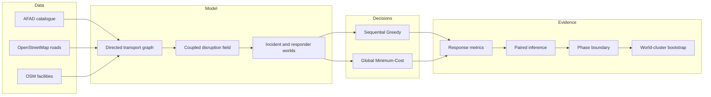

# Architecture — v1.0

## Purpose

The repository separates data acquisition, stochastic simulation, decision algorithms,
statistical inference and public presentation so that each layer can be inspected independently.

## Design principles

**Reproducibility.** Random seeds, workflow inputs, artifacts, manifests and SHA-256 digests are
preserved.

**Paired comparison.** Algorithms are evaluated on the same stochastic world rather than on
independent random scenarios.

**Coupled severity.** A world's edge-risk uniforms are reused across increasing synthetic
severity so failure sets are nested.

**Explicit scope.** Synthetic disruption is kept separate from engineering fragility and official
disaster information.

**Inspectable baselines.** The release favours transparent Greedy and Global Minimum-Cost
Assignment methods over opaque learned policies, making the evidence chain easier to audit.

## Package layers

- `src/turkiye_disaster_twin/data/`: public-data access and normalization
- `src/turkiye_disaster_twin/simulation/`: scenarios, assignment and metrics
- `src/turkiye_disaster_twin/research/`: artifact and reliability-boundary logic
- `scripts/`: benchmark entry points
- `tests/`: regression and research-method tests
- `.github/workflows/`: CI and reproducible benchmark execution
- `results/`: frozen evidence
- `docs/`: public research presentation

## Persistent research record

The architecture documented here corresponds to the frozen **v1.0.0** research release.

- Version DOI: https://doi.org/10.5281/zenodo.21903851
- Concept DOI: https://doi.org/10.5281/zenodo.21903850
- Full project documentation: https://faramarzkowsari.github.io/turkiye-disaster-intelligence-digital-twin/project.html
