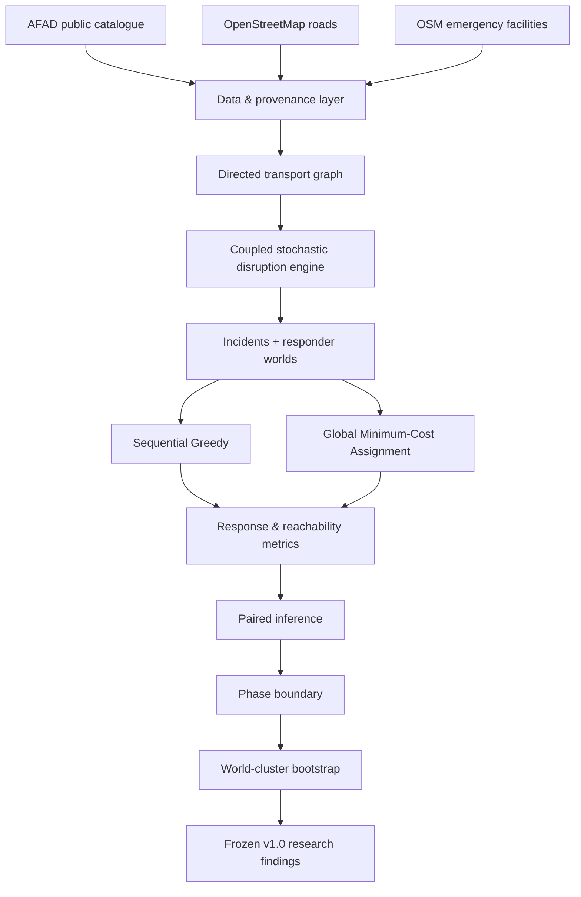

<p align="center">
  
</p>

<h1 align="center">Türkiye Disaster Intelligence Digital Twin</h1>

<p align="center">
  <strong>Reproducible graph-based disaster-response research platform for Türkiye</strong>
</p>

<p align="center">
  <a href="https://github.com/FaramarzKowsari/turkiye-disaster-intelligence-digital-twin/actions/workflows/ci.yml">
    
  </a>
  
  
  
  
  
</p>

<p align="center">
  <a href="#english">English</a> ·
  <a href="#türkçe">Türkçe</a> ·
  <a href="#español-españa">Español (España)</a> ·
  <a href="https://faramarzkowsari.github.io/turkiye-disaster-intelligence-digital-twin/">Project Website</a> ·
  <a href="https://faramarzkowsari.github.io/turkiye-disaster-intelligence-digital-twin/research-findings.html">Research Findings</a>
</p>

> **Research and safety boundary:** this repository is a research prototype and reproducibility
> package. It does not predict earthquakes, infer certified physical damage, estimate official
> casualties or losses, issue warnings, or replace AFAD, public authorities, emergency services,
> structural engineers or operational dispatch systems.

---

<a id="english"></a>

# English

## Research question

> Under uncertain post-earthquake road disruption, how do network connectivity, responder
> availability and graph-aware assignment interact to determine whether emergency incidents
> remain reachable?

The project treats a road network as a stochastic emergency-response graph. It combines public
AFAD earthquake catalogue access, OpenStreetMap road and facility data, reproducible synthetic
road-disruption scenarios, paired Monte Carlo experiments and transparent assignment algorithms.

The core scientific contribution of the v1.0 research release is a **coupled reliability-boundary
experiment**. Instead of comparing unrelated random scenarios at each disruption level, the same
stochastic world is progressively stressed across severity. This preserves common random numbers
and creates nested road failures, allowing the experiment to locate where a response system moves
from a resource-limited regime toward a connectivity-limited regime.

## What is implemented

- AFAD catalogue ingestion and OpenStreetMap road/facility acquisition
- district-scale interactive digital-twin interface
- reproducible synthetic road-disruption scenario engine
- sequential Greedy dispatch baseline
- Global Minimum-Cost Assignment baseline
- paired Monte Carlo experiment laboratory
- paper-grade paired inference with Holm multiple-testing correction
- coupled severity worlds with monotone failure fields
- phase-transition and resource-frontier analysis
- confirmatory 80/80 reliability-boundary estimation
- world-cluster bootstrap uncertainty intervals
- GitHub Actions research benchmarks and preserved artifacts
- SHA-256 provenance manifests and frozen research outputs
- trilingual public research presentation: English, Turkish and Spanish

## Final confirmatory result

The primary estimand is the **synthetic severity control at which the probability of maintaining
at least 80% incident reachability crosses 80%**.

| Responders | Boundary estimate | 95% world-bootstrap interval |
|---:|---:|---:|
| 12 | 0.142500 | 0.134000–0.148462 |
| 14 | 0.149167 | 0.142500–0.156000 |
| 16 | 0.152500 | 0.145333–0.160000 |
| 20 | 0.154500 | 0.147000–0.163214 |
| 24 | 0.158333 | 0.148462–0.168214 |
| 32 | 0.162500 | 0.154167–0.172727 |

Across the tested range, increasing responder availability shifts the reliability boundary
upward. The point estimate rises from **0.1425** with 12 responders to **0.1625** with 32.
The relationship is useful but not linear: additional responders continue to help while the
marginal boundary gain per added responder diminishes.

For the Global Minimum-Cost Assignment algorithm, the coupled monotonicity audit recorded zero
reachability-increase violations across the frozen confirmatory grids. The synthetic failed-edge
field was also monotone by construction and audit.

For total response time, Global Minimum-Cost Assignment outperformed the sequential Greedy
baseline in all 66 fine-grid cells of the primary confirmatory run and all 36 cells of the
upper-bound extension after Holm correction at the 0.05 level.

**Interpretation:** optimisation improves the use of resources that remain reachable. It cannot
create a road path after network connectivity has been lost. The experiment therefore exposes a
meaningful boundary between assignment efficiency and topology-driven failure.

## Architecture



## Reproducibility

The frozen confirmatory findings are derived from two GitHub Actions runs on the same v0.7 code
state and base seed `7070`:

- primary fine-grid confirmatory run: `31582171618`
- upper-bound extension: `31585895864`

The repository preserves raw/derived tables, source workflow artifacts, checksums and the v0.8
frozen manifest under `results/final_v0.8/`.

See [`REPRODUCIBILITY.md`](REPRODUCIBILITY.md) for the exact evidence chain.

## Scope and limitations

The `severity` variable is a **synthetic network-disruption control parameter**. It is not
earthquake magnitude, PGA, an engineering fragility index or an official operational threshold.

The v1.0 results are a Beykoz pilot experiment. They demonstrate a reproducible computational
method; they are not a validated estimate of İstanbul-wide or Türkiye-wide emergency performance.
Operational use would require authoritative infrastructure data, engineering fragility models,
real resource inventories, calibration against observed disasters, governance controls and
institutional validation.

## Repository map

```text
app/                         Streamlit research interface
docs/                        GitHub Pages research presentation
results/                     Frozen benchmark evidence
scripts/                     Reproducible benchmark entry points
src/turkiye_disaster_twin/   Research software package
tests/                       Automated tests
.github/workflows/            CI and research benchmark workflows
```

## Local installation

```bash
python -m venv .venv
# Windows
.venv\Scripts\activate
# macOS / Linux
source .venv/bin/activate

pip install -e ".[dev,app,research]"
pytest
```

## Research release

**v1.0.0** closes the first research cycle. New features are intentionally outside this release
unless they support a separately defined research question. The preserved v1.0 repository is
intended to remain inspectable, reproducible and citable.

---

<a id="türkçe"></a>

# Türkçe

## Araştırma sorusu

> Deprem sonrası yol ağındaki belirsiz kesintiler altında ağ bağlantılılığı, müdahale ekibi
> sayısı ve graf tabanlı kaynak ataması; acil olayların erişilebilir kalıp kalmayacağını nasıl
> birlikte belirler?

Proje, yol ağını stokastik bir acil müdahale grafı olarak ele alır. AFAD'ın açık deprem katalog
verilerine erişim, OpenStreetMap yol ve tesis verileri, tekrar üretilebilir sentetik yol kesintisi
senaryoları, eşleştirilmiş Monte Carlo deneyleri ve şeffaf atama algoritmaları aynı araştırma
platformunda birleştirilmiştir.

v1.0 sürümünün temel bilimsel bileşeni **eşleştirilmiş güvenilirlik sınırı deneyidir**. Her kesinti
şiddetinde birbirinden bağımsız rastgele dünyalar üretmek yerine aynı stokastik dünya kademeli
olarak zorlanır. Böylece ortak rastgele sayılar korunur, yol kesintileri iç içe büyür ve sistemin
kaynak yetersizliğinden ağ bağlantılılığıyla sınırlanan bir rejime geçişi ölçülebilir hâle gelir.

## Uygulanan bileşenler

- AFAD katalog erişimi ve OpenStreetMap yol/tesis veri alımı
- ilçe ölçeğinde etkileşimli dijital ikiz arayüzü
- tekrar üretilebilir sentetik yol kesintisi motoru
- sıralı Greedy temel yöntemi
- Global Minimum-Cost Assignment
- eşleştirilmiş Monte Carlo deney laboratuvarı
- Holm düzeltmeli makale düzeyi istatistiksel çıkarım
- monoton arıza alanlarına sahip eşleştirilmiş şiddet dünyaları
- faz geçişi ve kaynak sınırı analizi
- doğrulayıcı 80/80 güvenilirlik sınırı tahmini
- dünya-küme bootstrap belirsizlik aralıkları
- GitHub Actions araştırma benchmark'ları
- SHA-256 kaynak izlenebilirliği ve dondurulmuş araştırma çıktıları
- İngilizce, Türkçe ve İspanyolca açık araştırma sunumu

## Nihai doğrulayıcı sonuç

Birincil ölçüt, **olayların en az %80'ine erişilebilirliğin korunma olasılığının %80'i geçtiği
sentetik kesinti şiddeti sınırıdır**.

| Müdahale ekibi | Sınır tahmini | %95 dünya-bootstrap aralığı |
|---:|---:|---:|
| 12 | 0.142500 | 0.134000–0.148462 |
| 14 | 0.149167 | 0.142500–0.156000 |
| 16 | 0.152500 | 0.145333–0.160000 |
| 20 | 0.154500 | 0.147000–0.163214 |
| 24 | 0.158333 | 0.148462–0.168214 |
| 32 | 0.162500 | 0.154167–0.172727 |

Test edilen aralıkta daha fazla müdahale ekibi güvenilirlik sınırını yükseltmektedir. Nokta tahmini
12 ekipte **0.1425** iken 32 ekipte **0.1625** düzeyine çıkmaktadır. Bununla birlikte ilişki
doğrusal değildir; ek kaynak fayda sağlamaya devam ederken ekip başına marjinal kazanç azalır.

Global Minimum-Cost Assignment, erişilebilir kaynakların kullanımını iyileştirir; ancak ağda rota
kalmadığında yeni bir bağlantı yaratamaz. Bu nedenle çalışma, atama verimliliği ile topoloji
kaynaklı başarısızlık arasındaki sınırı görünür kılar.

## Bilimsel sınır

Buradaki `severity`, **sentetik bir ağ kesintisi kontrol parametresidir**. Deprem büyüklüğü, PGA,
mühendislik kırılganlık indeksi veya resmî operasyon eşiği değildir.

v1.0 sonuçları Beykoz pilot ağına aittir. İstanbul veya Türkiye geneline doğrulanmış operasyonel
performans tahmini olarak yorumlanmamalıdır.

## Tekrar üretilebilirlik

Dondurulmuş doğrulayıcı sonuçlar aynı v0.7 kod durumu ve `7070` temel tohumu ile iki GitHub Actions
çalıştırmasından türetilmiştir:

- ana doğrulayıcı ince ızgara: `31582171618`
- üst sınır genişletmesi: `31585895864`

Ham ve türetilmiş tablolar, kaynak artifact'ler, checksum'lar ve dondurulmuş manifest
`results/final_v0.8/` altında korunmaktadır.

---

<a id="español-españa"></a>

# Español (España)

## Pregunta de investigación

> Bajo interrupciones inciertas de la red viaria tras un terremoto, ¿cómo interactúan la
> conectividad, la disponibilidad de recursos y la asignación basada en grafos para determinar
> si los incidentes de emergencia siguen siendo alcanzables?

El proyecto modela la red viaria como un grafo estocástico de respuesta a emergencias. Integra el
acceso al catálogo público de AFAD, carreteras e instalaciones de OpenStreetMap, escenarios
sintéticos reproducibles de interrupción, experimentos Monte Carlo emparejados y algoritmos
transparentes de asignación.

La principal aportación experimental de v1.0 es un **estudio acoplado de frontera de fiabilidad**.
El mismo mundo estocástico se somete progresivamente a niveles crecientes de interrupción, en lugar
de comparar mundos aleatorios no relacionados. Esto permite estudiar el paso desde un régimen
limitado por recursos hacia otro limitado por la conectividad de la red.

## Componentes implementados

- acceso al catálogo de AFAD y adquisición de datos de OpenStreetMap
- interfaz interactiva de gemelo digital a escala de distrito
- motor reproducible de interrupciones viarias sintéticas
- referencia de despacho Greedy secuencial
- Asignación Global de Coste Mínimo
- laboratorio Monte Carlo emparejado
- inferencia estadística con corrección de Holm
- mundos de severidad acoplados con fallos monótonos
- análisis de transición de fase y frontera de recursos
- estimación confirmatoria de la frontera 80/80
- intervalos bootstrap agrupados por mundo
- benchmarks reproducibles mediante GitHub Actions
- procedencia SHA-256 y resultados congelados
- presentación pública en inglés, turco y español

## Resultado confirmatorio final

El estimando principal es el **nivel sintético de interrupción en el que la probabilidad de
mantener al menos un 80% de accesibilidad cruza el 80%**.

| Recursos | Estimación de frontera | Intervalo bootstrap del 95% |
|---:|---:|---:|
| 12 | 0.142500 | 0.134000–0.148462 |
| 14 | 0.149167 | 0.142500–0.156000 |
| 16 | 0.152500 | 0.145333–0.160000 |
| 20 | 0.154500 | 0.147000–0.163214 |
| 24 | 0.158333 | 0.148462–0.168214 |
| 32 | 0.162500 | 0.154167–0.172727 |

La estimación aumenta desde **0.1425** con 12 recursos hasta **0.1625** con 32. Los recursos
adicionales siguen ampliando la región fiable, pero el beneficio marginal por recurso disminuye.

La Asignación Global de Coste Mínimo mejora la eficiencia entre recursos todavía alcanzables, pero
no puede fabricar conectividad cuando la red interrumpida ya no contiene una ruta. El experimento
hace visible la frontera entre eficiencia de asignación y fallo impuesto por la topología.

## Límite científico

`severity` es un **parámetro sintético de control de interrupción de red**. No representa magnitud
sísmica, PGA, fragilidad estructural ni un umbral operativo oficial.

Los resultados de v1.0 corresponden al piloto de Beykoz y no deben interpretarse como una
estimación operativa validada para todo Estambul o Türkiye.

## Reproducibilidad

Los resultados confirmatorios congelados proceden de dos ejecuciones de GitHub Actions con el
mismo estado de código v0.7 y semilla base `7070`:

- ejecución confirmatoria principal: `31582171618`
- extensión del límite superior: `31585895864`

Las tablas, artefactos, checksums y el manifiesto final se conservan en
`results/final_v0.8/`.

---

## About / Hakkında / Sobre el autor

<table>
<tr>
<td width="180" valign="top">
  
</td>
<td valign="top">

### Faramarz Kowsari

**Author · Software Engineer · AI Researcher**  
**Yazar · Yazılım Mühendisi · Yapay Zekâ Araştırmacısı**  
**Autor · Ingeniero de Software · Investigador en Inteligencia Artificial**

Faramarz Kowsari is an Istanbul-based author, Software Engineer and AI researcher who develops
open research software, technical web tools and educational content.

Faramarz Kowsari, İstanbul merkezli bir yazar, Yazılım Mühendisi ve Yapay Zekâ araştırmacısıdır;
açık araştırma yazılımları, teknik web araçları ve eğitim içerikleri geliştirir.

Faramarz Kowsari es autor, ingeniero de software e investigador en Inteligencia Artificial
afincado en Estambul; desarrolla software abierto de investigación, herramientas web técnicas y
contenidos educativos.

[ORCID](https://orcid.org/0000-0003-1692-0453) ·
[Google Scholar](https://scholar.google.com/citations?user=G7tP5WMAAAAJ&hl=en) ·
[GitHub](https://github.com/FaramarzKowsari) ·
[LinkedIn](https://www.linkedin.com/in/faramarzkowsari) ·
[Official Website](https://faramarzkowsari.github.io)

</td>
</tr>
</table>

## Citation

Please use [`CITATION.cff`](CITATION.cff) for machine-readable citation metadata.

## License

MIT. See [`LICENSE`](LICENSE).
