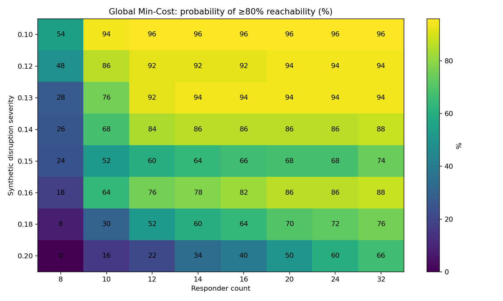
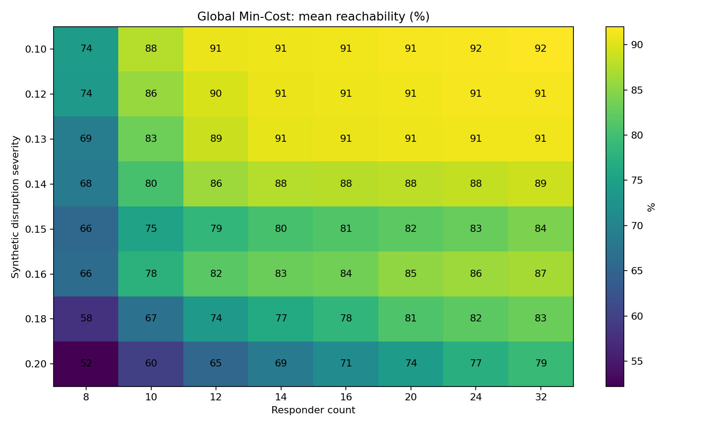
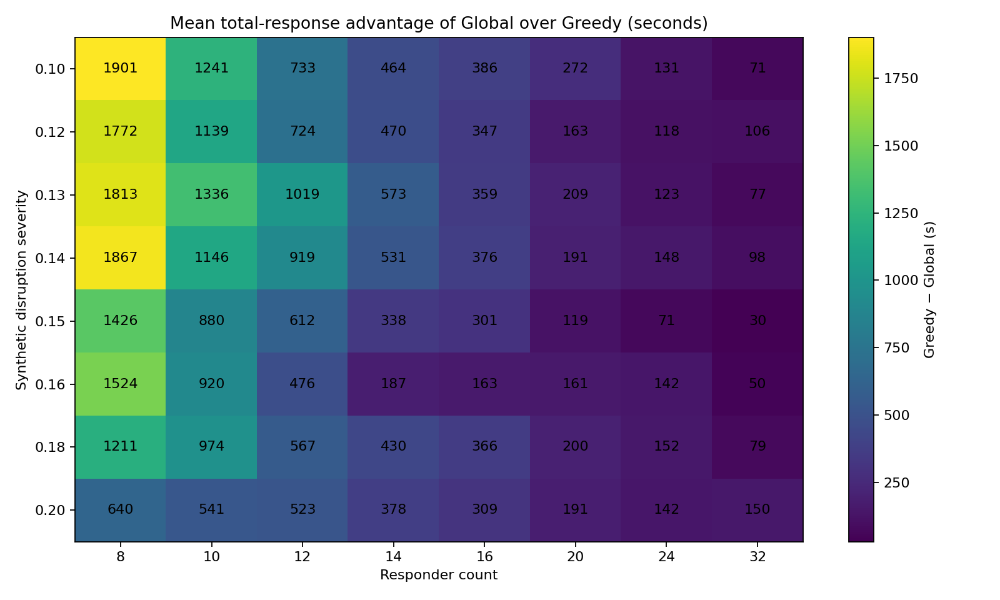

# Phase Transition Benchmark #2 — Focused Boundary Study

GitHub Actions run: `31539423469`  
Artifact ID: `9120257820`  
Artifact: `disaster-twin-phase-transition-31539423469-attempt-1`  
Source commit: `6a16f881565fd58305da9819db4db666e0a1df69`  
Pilot area: `Beykoz, İstanbul, Türkiye`  
Realisations per grid cell: `50`  
Incidents per realisation: `10`  
Responder counts: `8, 10, 12, 14, 16, 20, 24, 32`  
Synthetic severities: `0.10, 0.12, 0.13, 0.14, 0.15, 0.16, 0.18, 0.20`  
Base seed: `5050`

## English

This focused benchmark produced **6,400 algorithm-level observations**. The broad result from
Benchmark #1 is confirmed: additional responders restore service effectively at lower disruption
levels, but their marginal value falls as network connectivity becomes the dominant constraint.

For Global Minimum-Cost Assignment, the 80% reachability / 80% reliability resource frontier was:

| Severity | Minimum responders meeting the target |
|---:|---:|
| 0.10 | 10 |
| 0.12 | 10 |
| 0.13 | 12 |
| 0.14 | 12 |
| 0.15 | not reached within 32 responders |
| 0.16 | 16 |
| 0.18 | not reached within 32 responders |
| 0.20 | not reached within 32 responders |

At 32 responders, mean reachability declined from **92.0%** at severity 0.10 to **79.2%** at
severity 0.20. The probability of reaching at least 80% service declined from **96%** to **66%**.
At severity 0.20, expanding from 24 to 32 responders improved mean reachability by only **2.0
percentage points**, evidence of strong connectivity saturation.

Global optimisation again changed *efficiency* much more than *access*. Across the full grid, its
mean reachability advantage over Greedy averaged only **0.28 percentage points** and never exceeded
**0.8 points**. By contrast, the mean Greedy-minus-Global total-response difference ranged from
about **30 to 1,901 seconds**, and 59 of 64 grid cells remained significant after Holm correction.

### Important design finding

The apparent frontier is not perfectly monotone across severity. In particular, severity 0.15
failed the 80/80 target even with 32 responders, while severity 0.16 reached it with 16 responders.
This must **not** be interpreted as 0.16 being safer than 0.15.

The v0.5 experiment used independent random worlds for different severity levels. With only 50
realisations per severity, sampling variation is large enough to create local reversals. For 32
responders, service-target probability was 74% at severity 0.15 (Wilson 95% interval approximately
60.4–84.1%) and 88% at 0.16 (approximately 76.2–94.4%); the intervals overlap substantially.

This benchmark therefore identified the next methodological requirement: **common random numbers
must be coupled across severity as well as across responder levels**. v0.6 implements exactly that.

## Türkçe

Bu odaklanmış benchmark **6.400 algoritma düzeyi gözlem** üretti. Benchmark #1'in ana sonucu
tekrar doğrulandı: düşük kesinti şiddetlerinde ek müdahale ekipleri hizmet düzeyini etkili biçimde
geri getirirken, ağ bağlantılılığı baskın sınıra dönüştükçe ek kaynakların marjinal getirisi azalır.

Global Minimum-Cost Assignment için %80 erişilebilirlik / %80 güvenilirlik hedefi 0.10 ve 0.12
şiddetlerinde 10 ekip, 0.13 ve 0.14'te 12 ekip ile karşılandı. 0.18 ve 0.20'de 32 ekip bile hedefi
karşılamadı. 32 ekipte ortalama erişilebilirlik 0.10 şiddetinde %92,0 iken 0.20'de %79,2'ye düştü;
%80 hizmete ulaşma olasılığı da %96'dan %66'ya geriledi.

Global yöntem erişilebilirliği çok az artırdı: tüm grid boyunca Greedy'ye göre ortalama avantajı
yalnızca **0,28 yüzde puanı**, maksimum avantajı **0,8 puan** oldu. Buna karşılık toplam müdahale
süresindeki Greedy−Global farkı yaklaşık **30–1.901 saniye** aralığındaydı. Bu, optimizasyonun
ulaşılabilir kaynakları daha verimli kullandığını; fakat yeni bağlantı oluşturamadığını gösterir.

Önemli metodolojik bulgu şudur: 0.15 şiddetinin 0.16'dan kötü görünmesi fiziksel bir sonuç değildir.
v0.5'te farklı şiddetler bağımsız rastgele dünyalar kullandığı için 50 gerçekleşmelik örneklemde
yerel ters sıralamalar oluşabilmektedir. v0.6 aynı rastgele dünyayı tüm şiddet seviyelerinde
koruyacak ve şiddet arttıkça yol kesintilerinin yalnızca artmasına izin verecektir.

## Español (España)

Este benchmark focalizado produjo **6.400 observaciones a nivel de algoritmo**. Se confirma el
resultado principal del Benchmark #1: con niveles bajos de interrupción, añadir recursos de
respuesta restaura el servicio con eficacia; a medida que la conectividad pasa a ser la restricción
dominante, el rendimiento marginal de añadir recursos disminuye.

Para la asignación global de coste mínimo, el objetivo 80% de accesibilidad / 80% de fiabilidad se
alcanzó con 10 recursos en severidades 0,10 y 0,12, y con 12 recursos en 0,13 y 0,14. En 0,18 y
0,20, ni siquiera 32 recursos alcanzaron el objetivo. Con 32 recursos, la accesibilidad media cayó
del 92,0% en 0,10 al 79,2% en 0,20, y la probabilidad de alcanzar al menos 80% de servicio cayó del
96% al 66%.

La optimización global modificó mucho más la eficiencia que el acceso. Su ventaja media de
accesibilidad frente a Greedy fue de solo **0,28 puntos porcentuales**, con un máximo de **0,8**,
mientras que la diferencia media Greedy−Global en tiempo total de respuesta osciló entre unos
**30 y 1.901 segundos**.

La inversión local entre severidad 0,15 y 0,16 no debe interpretarse físicamente. En v0.5 cada
severidad utilizó mundos aleatorios independientes, por lo que con 50 realizaciones pueden aparecer
inversiones por variabilidad muestral. v0.6 acopla los mismos números aleatorios entre niveles de
severidad, de modo que una severidad mayor solo puede añadir interrupciones, nunca eliminar las ya
existentes.
